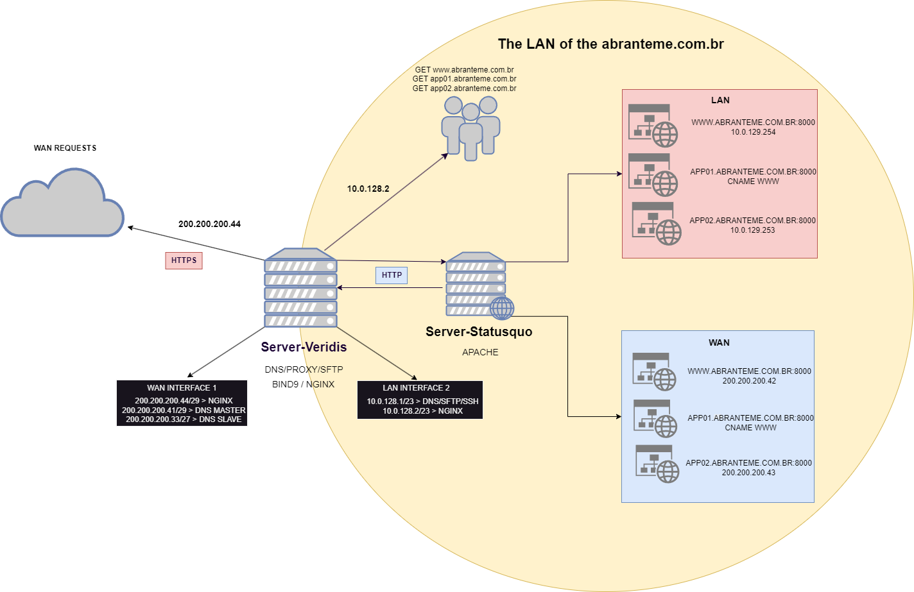
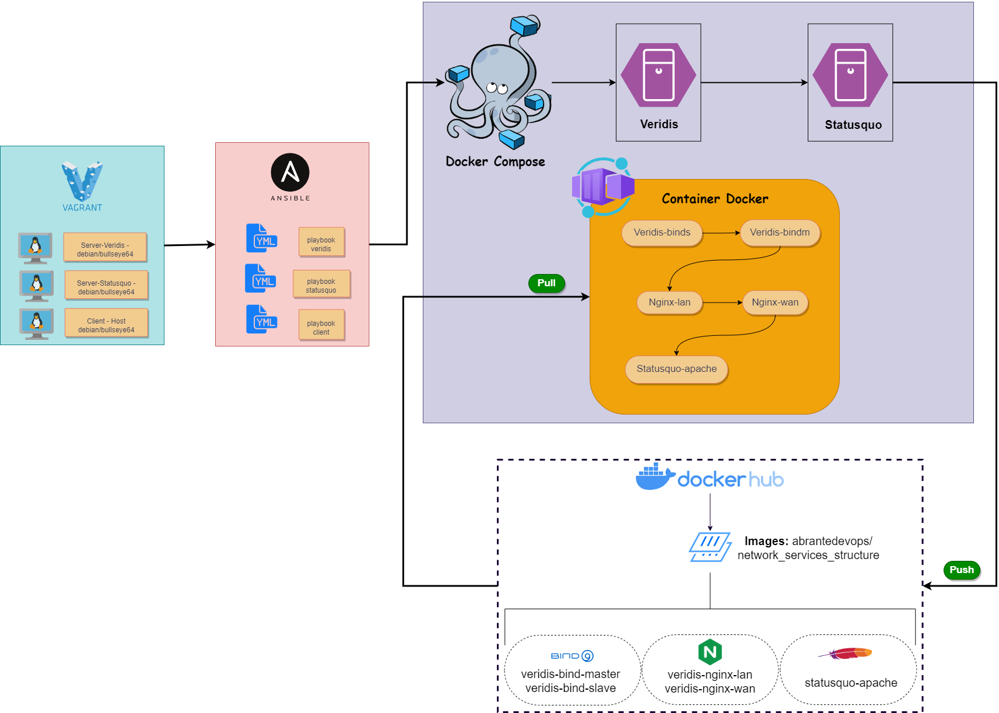
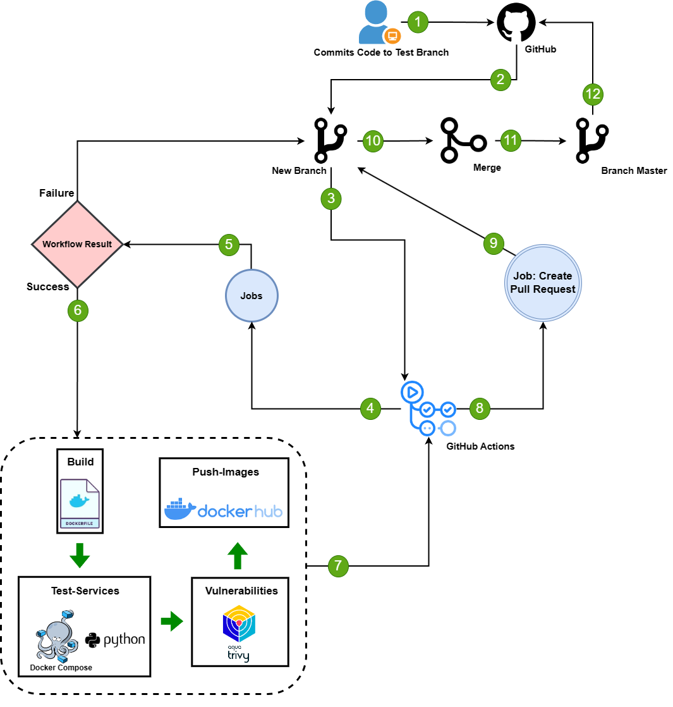

<h1>Mãos à obra: Provisionando sistemas e serviços com Vagrant, Ansible e Docker</h1>

<p align="center" style="display: flex; justify-content: center;">
  <a href="https://www.vagrantup.com/downloads" style="margin-right: 0.5rem;">
    
  </a>

  <a href="https://www.ansible.com/" style="margin-right: 0.5rem;">
    
  </a>

  <a href="https://www.docker.com/" style="margin-right: 0.5rem;">
    
  </a>
</p>


<p align="center"></p>

Infraestrutura como código (IaC) é uma prática de desenvolvimento de software que se enquadra na abordagem DevOps. Ela envolve a automação e gerenciamento da infraestrutura de um sistema de computador usando código, assim, as tecnologias empregadas neste tutorial, em conjunto o Vagrant, o Ansible e o Docker fornecem uma poderosa combinação de ferramentas para a criação, provisionamento e implantação de infraestrutura e aplicativos como código. Eles permitem definir, compartilhar e gerenciar toda a pilha de infraestrutura, desde a configuração do sistema até a execução de aplicativos, de forma automatizada e escalável. 

<h2>Escopo</h2>

A base deste tutorial consiste basicamente no provisionamento de servidores Linux bem como algumas configurações de gerenciamento de disco, hardening Linux, BIND9, Nginx e Apache. A seguir, temos uma imagem que ilustra a arquitetura do cenário proposto.

<p align="center"></p>


Comentando com mais detalhes, temos: 
- Instalação e configuração realizadas no Virtual Box, utilização do sistema Debian versão mais recente (11 bullseye64), Adição de 3 HDs de 10GB para o gerenciamento de disco no Server-Veridis, adição de 2 interfaces de rede para o Server-Veridis e para o Server-Statusquo.

- O gerenciamento de disco compreendeu o uso de 3 discos para redundância completa dos dados, onde no Server-Veridis foram criadas as seguintes partições:
/dados/www (Tipo ext4, 2 Gbits)
/dados/jornal (Tipo ext4, 3 Gbits)
Em seguida, foram criados RAID para cada partição. Por fim, foi criado um LVM para cada RAID, sendo para /dados/www e /dados/jornal.

- Com relação aos Requisitos de Rede foi feita a configuração dos 3 primeiros endereços IPs da 2ª subrede de 8 IPs da faixa 200.200.200.32/27 para a inteface WAN. Para a interface LAN foi utilizada a rede 10.0.128.0/23.

- No Server-Veridis, para a segurança de Acesso ao Sistema foram implementados os procedimentos de: Acesso remoto permitido somente por meio de chaves de criptografia assimétrica, Restrição de acesso local para o usuário root, Acesso local permitido apenas para o usuário suporte, Configuração do tempo de inatividade para realizar logout automático após 5 minutos de inatividade, Acesso de super usuário deve ser realizado com o comando sudo.

- Para o Serviço DNS foi configurado o serviço de DNS primário para responder pelo domínio abranteme.com.br. Foram definidos os seguintes requisitos: TTL máximo padrão dos registros: 24h, fácil identificação da última alteração no arquivo de zona, verificação de alterações no servidor primário a cada 1 hora pelo servidor secundário (slave), configuração de 2 views: View Externa: Atendimento de requisições de DNS apenas da interface WAN, registros: DNS Primário (ns01.abranteme.com.br), DNS Secundário (ns02.abranteme.com.br), Portal WEB (www.abranteme.com.br), Aplicação 01 (app01.abranteme.com.br) e Aplicação 02 (app02.abranteme.com.br). Na View Interna: Atendimento de requisições apenas da LAN, permitir uso como servidor recursivo, registros: DNS Primário (ns01.abranteme.com.br), Portal WEB (www.abranteme.com.br), Aplicação 01 (app01.abranteme.com.br) e Aplicação 02 (app02.abranteme.com.br).

- Para o Serviço WEB foi utilizado no Server-Veridis o Nginx como Proxy WEB e Load Balancer para os serviços. A comunicação entre cliente e Nginx (Internet - Interface WAN) obrigatoriamente via HTTPS, e entre Nginx e Apache apenas HTTP. A configuração do Apache (Server-Statusquo) foi realizada com os seguintes requisitos: Atendimento de requisições na porta 8000, Impedimento de listagem de conteúdo de diretórios pelo acesso WEB, Não permitir criação de links simbólicos, Configuração de 2 virtual hosts: app01.abranteme.com.br: Diretório do site: /dados/www/app01, Adição de arquivo index.html para testes do "App01", app02.abranteme.com.br: Diretório do site: /dados/www/app02, Adição de arquivo index.html para testes do "App02", Acesso com autenticação do usuário "jornalista" ao diretório para obtenção dos arquivos postados, Leitura do conteúdo do diretório do serviço SFTP (/dados/jornal) pelo Apache.

- Para o Serviço SFTP foi configurado o servidor OpenSSH para atender requisições SFTP na porta 22, com os seguintes requisitos: Criação de usuário "jornalista" com acesso ao diretório /dados/jornal.


<h2>Gerenciando o Cenário</h2>

A estrutura do tutorial envolvendo o Vagrant e o Ansible e o Docker está ilustrada na imagem abaixo. Foram configurados três máquinas virtuais a partir do arquivo vagrantfile, sendo elas: Server-Veridis, Server-Statusquo e Client-Host. Em seguida, para cada uma das máquinas virtuais o ansible é inicializado a partir dos arquivos de configuração playbook.yml, que por sua vez envia o arquivo docker-compose.yml para dentro de cada uma das VMs. Por fim, para as VMs Server-Veridis e Server-Statusquo o docker é utilizado para a criação de containers dos serviços de DNS, Nginx e Apache a partir das imagens que foram anteriormente criadas mediante modificação de acordo com as necessidades para atender os requisitos do tutorial. A VM do Cliente-Host é utilizada para testar a parte do acesso remoto ao servidor Veridis, bem como o serviço de SFTP.

<p align="center"></p>

<h2>Pipeline CI/CD</h2>

Para a criação do pipeline CI/CD foi utilizado o GitHub Actions, que é uma ferramenta de integração e entrega contínua incorporado ao GitHub. A branch "dev" foi configurada para ser a branch de teste, onde a build das imagens Docker (CI) são realizadas e encaminhadas ao registry (CD). A pipeline foi configurada para executar as seguintes etapas:

- Build das imagens Docker: É responsável por construir a imagem docker do servodpr DNS Primário e Secundário, do servidor proxy Nginx para requisições LAN e WAN e por fim do servidor web Apache que contém os virtual hosts para os serviços app01 e app02.

- Testes dos Serviços: São realizados com o auxílio de scripts que verificam se os serviços do BIND9, Nginx e Apache estão ativos e respondendo corretamente através dos containers criados a partir das imagens Docker da etapa anterior.

- Vulnerabilidades: Após os testes é iniciado a análise de vulnerabilidades com o auxílio da ferramenta Trivy, que é um scanner de código aberto para imagens e artefatos de contêiner.

- Push: Após a conclusão das etapas anteriores, as imagens são encaminhadas ao registry Dockerhub para que possam ser baixadas e utilizadas no tutorial.


<p align="center"></p>


<h2>Pré-requisitos e Indicações</h2>

- Antes de começar, o Vagrantfile utiliza o Provider VirtualBox, portanto é necessário que o mesmo esteja instalado em sua máquina. Caso não tenha, acesse o link abaixo e siga as instruções de instalação: [VirtualBox](https://www.virtualbox.org/wiki/Downloads)

- Após todo o processo de provisionamento finalizar, para acessar o servidor Veridis, Statusquo e o Client-Host a partir da máquina real, utilize os seguintes comandos:

```bash
vagrant ssh veridis
vagrant ssh statusquo
vagrant ssh client
```


- Para o acesso remoto ao servidor Veridis foi criado um par de chaves de criptografia assimétrica, logo de dentro da VM Client-Host alterne para o usuário suporte e acesse o servidor Veridis com o comando abaixo:

```bash
su suporte
passord: 1234
ssh suporte@10.0.128.1
```

- Do mesmo modo, para testar o serviço SFTP, pode ser utilizado o comando abaixo a partir da VM Client-Host:

```bash
su jornalista
password: 1234
sftp jornalista@10.0.128.1
```

- Os serviços podem ser inicializados a partir do comando abaixo:

```bash
# Clone este repositório
$ git clone https://github.com/abrantedevops/-Network-Services-Structure.git

# Acesse a pasta no terminal/cmd em que está o arquivo Vagrantfile
$ cd detools

# Execute o comando abaixo para criar as máquinas virtuais e executar o tutorial
$ vagrant up

# Nesse momento o Vagrantfile irá criar as máquinas virtuais e executar o playbook ansible para a instalação e configuração dos requisitos necessários para a execução do tutorial. Em seguida, o Docker Compose irá criar os containers e executar o tutorial. Para comunicação entre a máquina real e a máquina virtual Veridis foi provisionado uma interface do tipo Host-Only, desse modo, caso queira verificar o desempenho dos servidores DNS, Proxy e WEB, adicione no arquivo hosts da sua máquina real a configuração abaixo. Após isso, acesse os endereços de teste no navegador e verifique os serviços em funcionamento. Usuário e senha para validação em: http://app02.abranteme.com.br/jornal/ é "abranteme" e "abranteme".

192.168.57.7	www.abranteme.com.br	www.app01.abranteme.com.br	app01.abranteme.com.br	www.app02.abranteme.com.br  app02.abranteme.com.br

# Atenção: Como em toda execução do Vagrantfile são criados discos rígidos virtuais (necessários para o gerencimaento de disco), caso o vagrantfile seja executado novamente (vagrant up) com as VMs já criadas, é necessário executar o comando abaixo para destruir as máquinas virtuais e os containers criados anteriormente.
$ vagrant destroy -f

```

<h2>Referências</h2>

- [Vagrant](https://www.vagrantup.com/)
- [Ansible](https://www.ansible.com/)
- [Docker](https://www.docker.com/)
- [Docker Compose](https://docs.docker.com/compose/)
- [Docker Hub Repository](https://hub.docker.com/r/abrantedevops/network_services_structure)
- [Nginx](https://www.nginx.com/)
- [Apache](https://httpd.apache.org/)
- [Bind9](https://www.isc.org/bind/)
- [Images Overview](https://bell-sw.com/blog/bellsoft-s-docker-hub-images-overview/)
- [Trivy](https://trivy.dev/)
- [GitHub Actions](https://github.com/features/actions)


<h2>Licença</h2>


MIT License

Copyright (c) 2012-2023 Thiago Abrante de Souza

Permission is hereby granted, free of charge, to any person obtaining
a copy of this software and associated documentation files (the
"Software"), to deal in the Software without restriction, including
without limitation the rights to use, copy, modify, merge, publish,
distribute, sublicense, and/or sell copies of the Software, and to
permit persons to whom the Software is furnished to do so, subject to
the following conditions:

The above copyright notice and this permission notice shall be
included in all copies or substantial portions of the Software.

THE SOFTWARE IS PROVIDED "AS IS", WITHOUT WARRANTY OF ANY KIND,
EXPRESS OR IMPLIED, INCLUDING BUT NOT LIMITED TO THE WARRANTIES OF
MERCHANTABILITY, FITNESS FOR A PARTICULAR PURPOSE AND
NONINFRINGEMENT. IN NO EVENT SHALL THE AUTHORS OR COPYRIGHT HOLDERS BE
LIABLE FOR ANY CLAIM, DAMAGES OR OTHER LIABILITY, WHETHER IN AN ACTION
OF CONTRACT, TORT OR OTHERWISE, ARISING FROM, OUT OF OR IN CONNECTION
WITH THE SOFTWARE OR THE USE OR OTHER DEALINGS IN THE SOFTWARE.

<h1>Contato</h1>


- [Thiago A. Souza](mailto:thiago.abrante@academico.ifpb.edu.br)


